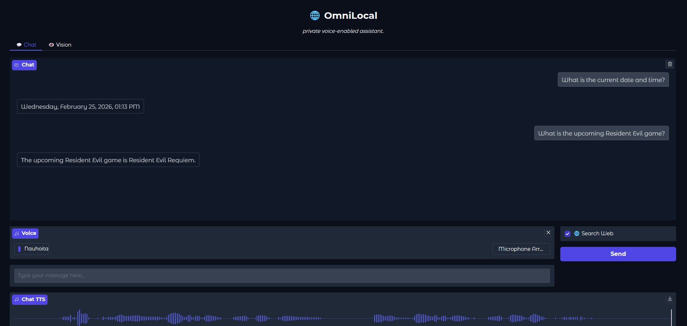
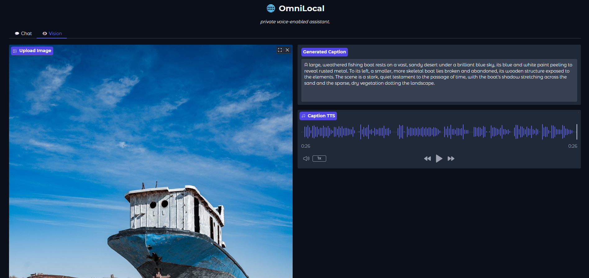

# 🌐 OmniLocal

Self-hosted WebUI and CLI that brings state-of-the-art language, vision, and speech model to local hardware.

Now updated with web search, current date and time, and microphone support.

---

## 🖵 Screenshots



## ✨ Features

* **100% Local & Private:** Runs entirely on your GPU, No API keys or subscriptions
* **VRAM Hot-Swapping:** A built-in `ModelManager` hot-swaps models in and out of GPU memory
* **Web Search:** Built-in web search using DuckDuckGo that bypasses model's training cutoff date.
* **Text-to-Speech:** Realistic voice responses powered by the `Kokoro-82M` engine
* **Conversational AI:** Chat intelligently using SOTA `Phi-4-mini-instruct` model
* **Image Captioning:** Upload images and have them analyzed using `Qwen3-VL-2B-Instruct`
* **Dual Interfaces:** Sleek WebUI using Gradio and lightweight CLI with Python

## 🛠️ Installation

### 1. Prerequisites
* **Nvidia GPU** (At least 6GB+ VRAM recommended)
* **Python 3.11+** installed on your system
* **PyTorch** with CUDA 12.1

### 2. Setup Environment
```
python -m venv venv
venv\Scripts\activate  # On Windows
source venv/bin/activate  # On Mac/Linux
```

### 3. Install PyTorch (CUDA)
```
pip install torch torchvision torchaudio --index-url https://download.pytorch.org/whl/cu121
```
### 4. Install Requirements
```
pip install -r requirements.txt
```

## 🚀 Usage

### Start Server

**Note: you need to run the server first before cli or webui**

```
uvicorn server:app
```

### WebUI
```
python app.py
```

### CLI
```
python cli.py
```

### CLI Commands

```
/search [query] to make a web search.

/image path/to/image.jpg to analyze an image.
```

## ☕ Support
If you find this project valuable, consider supporting my work:

[](https://buymeacoffee.com/vpakarinen)
[](https://ko-fi.com/vpakarinen)

## Author

Ville Pakarinen (@vpakarinen2)
